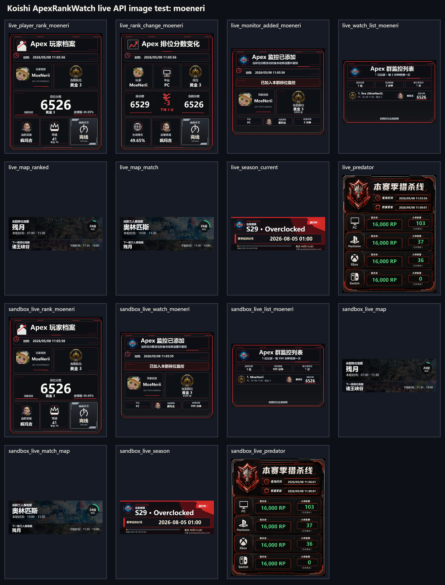

# koishi-plugin-apexrankwatch

[](https://www.npmjs.com/package/koishi-plugin-apexrankwatch)
[](https://koishi.chat/)
[](https://github.com/moeneri/koishi-plugin-apexrankwatch)
[](#许可证)

Koishi 版 Apex Rank Watch。填入 Apex Legends API Key 后，机器人可以查询玩家段位、地图轮换、赛季时间、猎杀线，并在群聊中持续监控排位分变化。

2.0 版迁移了 AstrBot 版的图片卡片、地图、赛季、猎杀线、黑名单、权限与赛季关键词自动回复能力，同时保留并扩展了 Koishi 版的备注、账号绑定与榜单功能。

## 快速开始

在 Koishi 控制台插件市场搜索并安装 `koishi-plugin-apexrankwatch`，然后在插件配置里填写 `apiKey`。

也可以在 Koishi 项目目录中手动安装：

```bash
npm install koishi-plugin-apexrankwatch
```

如果使用 pnpm 或 yarn：

```bash
pnpm add koishi-plugin-apexrankwatch
yarn add koishi-plugin-apexrankwatch
```

安装后可以先试这几个命令：

```text
/apexhelp
/apexrank moeneri pc
/apex绑定 moeneri pc
/apex查分
/apexrankwatch moeneri pc
/apex日上分榜
/map
/apexseason current
/apexpredator pc
```

## 实际效果

下图是使用真实 API 与 Koishi 沙箱命令生成的图片合集，包含玩家查询、分数变化、监控添加、监控列表、地图、赛季和猎杀线卡片。



## 功能亮点

- **图片化输出**：玩家档案、分数变化、监控添加、监控列表、上分榜、掉分榜、地图轮换、赛季信息、猎杀线均优先输出 PNG 图片。
- **账号绑定**：支持按用户全局绑定 Apex 玩家名或 UID，并通过 `/apex查分` 一键查询绑定账号。
- **玩家查询**：展示段位、RP、等级、UID、在线状态、当前英雄、英雄击杀排名与全球排名百分比。
- **群内监控**：按群保存监控玩家，定时检测排位分变化并推送通知。
- **备注优先显示**：监控列表、分数变化通知、榜单以及群内绑定查分场景会优先显示备注名。
- **榜单统计**：支持按北京时间自然日 / 自然周统计当前群的上分榜与掉分榜，并按净变化排序展示；HTML 榜单会以水平柱状图直观表现净上分 / 净掉分差异。
- **榜单头像**：HTML 榜单会优先使用“添加该监控项的 QQ 用户头像”，头像会按 URL 进行持久化缓存；若历史记录未直接携带监控创建者信息，会继续从当前群监控记录或绑定信息中回查，仍无法确定时才回退为占位头像。
- **地图轮换**：支持排位地图和三人赛匹配地图，展示当前地图、下一张地图和剩余时间。
- **赛季信息**：支持当前赛季、指定历史赛季和群内“赛季”关键词自动回复。
- **猎杀线**：查询本赛季各平台大师数量与猎杀底分，可按平台过滤。
- **权限与黑名单**：支持用户黑名单、玩家黑名单、运行时黑名单、群白名单、主人账号和私聊开关。
- **数据兼容**：兼容旧 Koishi 数据结构、AstrBot 风格数据、snake_case 配置与逗号分隔名单。

图片生成失败时会自动回退为文字输出，不会影响基础查询。

## 命令

### 查询

| 命令 | 说明 |
| --- | --- |
| `/apexhelp` | 查看图片帮助卡。 |
| `/apexrank <玩家名\|uid:...> [平台]` | 查询玩家段位信息。未指定平台时会按 PC、PlayStation、Xbox、Switch 自动尝试。 |
| `/apex查分 [玩家名\|uid:...]` | 不带参数时查询当前用户的绑定账号；带参数时按显式输入临时查询。 |
| `/map` | 查询排位地图轮换。 |
| `/匹配地图` | 查询三人赛匹配地图轮换。 |
| `/apexseason [赛季号\|current]` | 查询当前或指定赛季信息。 |
| `/apexpredator [平台]` | 查询猎杀线和大师数量。 |

### 账号绑定

| 命令 | 说明 |
| --- | --- |
| `/apex绑定 <玩家名\|uid:...> [平台]` | 为当前用户全局绑定默认 Apex 账号。绑定时会解析并固化最终查询平台。 |
| `/apex解绑` | 解绑当前用户已保存的 Apex 账号。 |
| `/apex我的账号` | 查看当前用户已绑定的 Apex 账号信息。 |
| `/apex绑定信息` | `/apex我的账号` 的等价命令。 |

### 监控

| 命令 | 说明 |
| --- | --- |
| `/apexrankwatch <玩家名\|uid:...> [平台]` | 将玩家加入当前群排位监控。 |
| `/apexranklist` | 查看当前群监控列表。若已有备注，会优先显示备注名。 |
| `/apexremark <玩家名\|uid:...> [平台] [备注]` | 设置或清除监控玩家备注。备注最长 32 字符，会清理换行、控制字符和多余空格。 |
| `/apexrankremove <玩家名\|uid:...> [平台]` | 从当前群移除玩家监控。 |

### 榜单

| 命令 | 说明 |
| --- | --- |
| `/apex日上分榜` | 查看当前群按北京时间自然日统计的上分榜，按净上分从高到低排序。 |
| `/apex日掉分榜` | 查看当前群按北京时间自然日统计的掉分榜，按净掉分从高到低展示。 |
| `/apex周上分榜` | 查看当前群按北京时间自然周统计的上分榜，按净上分从高到低排序。 |
| `/apex周掉分榜` | 查看当前群按北京时间自然周统计的掉分榜，按净掉分从高到低展示。 |

### 管理

| 命令 | 说明 |
| --- | --- |
| `/apextest` | 测试插件状态和主动消息能力。 |
| `/apexblacklist <add\|remove\|list\|clear> <玩家ID>` | 管理运行时玩家黑名单。 |
| `/赛季关闭` | 关闭当前群“赛季”关键词自动回复。 |
| `/赛季开启` | 开启当前群“赛季”关键词自动回复。 |

## 常用别名

- 查询玩家：`/apex查询`、`/视奸`
- 添加监控：`/apex监控`、`/持续视奸`
- 查看列表：`/apex列表`
- 设置备注：`/apex备注`
- 移除监控：`/apex移除`、`/取消持续视奸`
- 排位地图：`/地图`、`/排位地图`、`/apexmap`、`/apexrankmap`
- 赛季查询：`/apex赛季`、`/新赛季`
- 猎杀线：`/apex猎杀`、`/猎杀`
- 黑名单：`/apex黑名单`、`/不准视奸`、`/apexban`
- 帮助：`/apex帮助`、`/apexrankhelp`

## 参数说明

平台参数支持：`pc`、`ps`、`ps4`、`ps5`、`playstation`、`xbox`、`x1`、`switch`、`ns`、`nintendo`。保存和查询时会规范化为 `PC`、`PS4`、`X1`、`SWITCH`。

UID 查询支持 `uid:` 或 `uuid:` 前缀：

```text
/apexrank uid:0000000000000 pc
/apexrankwatch uuid:0000000000000 pc
/apex绑定 uid:0000000000000 pc
```

同名玩家可能在多个平台存在记录，添加监控、设置备注、移除监控或绑定账号时建议显式填写平台。

`/apex查分` 的行为规则：

- 不带参数：查询当前用户已绑定的账号。
- 带参数：按显式输入查询，等价于临时快捷查询。

榜单统计规则：

- 仅统计**当前群**的数据。
- 日榜按**北京时间自然日**统计。
- 周榜按**北京时间自然周（周一 00:00 起）**统计。
- 统计口径为**净变化**，即同一玩家在统计窗口内的所有分数变化求和。
- 即使玩家后来被移出监控，只要本统计周期内已有历史记录，仍可继续上榜。

## 配置

必填配置只有 `apiKey`。留空时插件仍可加载，但玩家查询、群监控和猎杀线不可用。

Koishi 控制台会按分组展示配置项。推荐使用 camelCase 字段；从旧版迁移时，snake_case 字段和 `foo,bar` / `foo，bar` 逗号分隔名单仍会被兼容读取。

| 配置项 | 默认值 | 说明 |
| --- | --- | --- |
| `apiKey` | 空 | Apex Legends API Key。 |
| `debugLogging` | `false` | 输出脱敏调试日志，用于排查 API 返回结构和错误原因。 |
| `checkInterval` | `2` | 排位分监控轮询间隔，单位为分钟。 |
| `timeout` | `10000` | HTTP 请求超时时间，单位为毫秒。 |
| `maxRetries` | `3` | API 请求失败后的最大重试次数。 |
| `minValidScore` | `1` | 最低有效排位分，低于该值会视为异常并跳过通知。 |
| `allowPrivate` | `true` | 是否允许私聊使用查询、帮助、地图、赛季和猎杀线命令。 |
| `ownerQq` | 空列表 | 主人账号 ID / QQ 号列表，拥有管理权限。 |
| `userBlacklist` | 空列表 | 禁止使用插件的用户 ID / QQ 号列表。 |
| `whitelistEnabled` | `false` | 是否开启群白名单模式。开启后只有白名单群可以使用插件。 |
| `whitelistGroups` | 空列表 | 群白名单 ID 列表。 |
| `blacklist` | 空列表 | 全局玩家黑名单，禁止查询和监控这些玩家 ID / UID。 |
| `queryBlocklist` | 空列表 | 查询黑名单，禁止查询和监控这些玩家 ID / UID。 |
| `dataDir` | `./data/apexrankwatch` | 数据与图片缓存目录。旧版 `groups.json` 与 AstrBot 风格数据会自动兼容。 |
| `leaderboardRenderMode` | `html` | 榜单输出模式，可选 `html`、`legacy`、`text`。 |
| `leaderboardEnableLegacyImageFallback` | `true` | HTML 榜单渲染失败后是否回退到旧榜单图片实现。 |
| `leaderboardEnableTextFallback` | `true` | 图像渲染失败后是否继续回退为文本榜单。 |
| `leaderboardResourceDir` | `./data/apexrankwatch/leaderboard` | 榜单资源目录，包含 `fonts/`、`backgrounds/`、`avatars/`、`templates/`。 |
| `leaderboardAvatarCacheTTL` | `86400` | 榜单头像成功缓存有效期，单位为秒。HTML 榜单默认会拉取“添加该监控项的 QQ 用户头像”并缓存。 |
| `leaderboardAvatarFailureCacheTTL` | `300` | 榜单头像失败缓存有效期，单位为秒。 |
| `leaderboardAvatarFetchTimeout` | `5000` | 榜单 QQ 头像抓取超时时间，单位为毫秒。 |
| `leaderboardViewportWidth` | `1180` | HTML 榜单基础视口宽度。 |
| `leaderboardDeviceScaleFactor` | `1` | HTML 榜单设备像素比。 |
| `leaderboardWaitUntil` | `networkidle0` | Puppeteer 页面等待策略。 |
| `leaderboardMaxRowsPerImage` | `10` | 单张榜单图片最大显示行数。 |
| `leaderboardTitleFont` | `Noto Sans CJK SC` | 榜单标题字体。 |
| `leaderboardBodyFont` | `Noto Sans CJK SC` | 榜单正文与昵称字体。 |
| `leaderboardNumberFont` | `Noto Sans CJK SC` | 榜单数字与排名字体。 |
| `leaderboardFontFallbackEnabled` | `true` | 是否启用内置字体回退与资源复制。关闭后仅使用资源目录中已有字体或系统字体。 |
| `leaderboardThemePreset` | `apex-red` | 榜单主题预设，例如 `default`、`dark`、`apex-red`、`minimal`。 |
| `leaderboardBackgroundType` | `preset` | 榜单背景类型，可选 `preset`、`css`、`file`、`url`、`api`。 |
| `leaderboardBackgroundValue` | 空 | 背景配置值：可为 CSS 内容、本地文件名、URL 或 API 地址。 |
| `leaderboardBackgroundApiKey` | 空 | 当背景类型为 `api` 时附带的访问凭证，会写入 `Authorization: Bearer` 与 `X-API-Key` 请求头。 |
| `leaderboardCustomCss` | 空 | 追加到榜单 HTML 模板中的自定义 CSS。 |

## API Key 与数据来源

玩家查询、群监控和猎杀线依赖 Apex Legends API Key。你可以在 Koishi 控制台的插件配置里填写 `apiKey`。

如果你的 Key 还没有完成验证，请到 `https://portal.apexlegendsapi.com/discord-auth` 绑定 Discord。未验证、失效或被限流的 Key 可能导致查询失败；插件会把常见鉴权和限流错误转成更明确的提示。

数据来源：

- 玩家查询、地图轮换、猎杀线来自 `api.mozambiquehe.re`。
- 当前赛季倒计时来自 `apexlegendsstatus.com`。
- 指定赛季信息来自 `apexseasons.online`。

第三方数据仅供参考，请以游戏内实际显示为准。

## 数据文件

默认数据目录为 `./data/apexrankwatch`，可通过 `dataDir` 修改。

- `groups.json`：群监控数据与玩家备注。
- `bindings.json`：用户全局绑定的 Apex 账号信息。
- `score-history.json`：榜单历史分数变化事件，默认保留最近 90 天。
- `settings.json`：运行时黑名单和赛季关键词开关。
- `*_cards/`：运行时生成的图片卡片缓存。
- `assets/`：地图、英雄、段位、在线状态和猎杀线模板素材。

## 从 1.x 升级到 2.0

- 2.0 新增图片生成依赖 `@napi-rs/canvas`，部署前请确认 Node.js `>=18` 且系统架构受支持。
- 2.0 会发布 `assets/` 素材目录，手动打包或本地链接时不要遗漏该目录。
- 旧版监控数据会自动兼容；如果你修改了 `dataDir`，请确保旧数据仍在对应目录。
- 名单类配置建议在 Koishi 控制台中逐项填写；旧版逗号分隔字符串仍可继续读取。
- `/apexremark` 是 Koishi 版保留功能，不会影响旧的查询和监控命令。
- 升级后首次启用榜单功能时，`score-history.json` 会从新版本开始逐步累积数据；历史榜单不会自动回填旧版本期间的分数变化。

## 注意事项

- 地图轮换、玩家段位和猎杀线来自第三方 API，网络波动或 API 限流时可能查询失败。
- 赛季时间与榜单统计范围会统一按**北京时间**展示与计算。
- 监控通知依赖 Koishi 适配器的主动消息能力；如果当前平台不支持主动消息，查询命令仍可正常使用。
- 插件使用 `@napi-rs/canvas` 生成图片，并随 npm 包发布 `assets/` 素材目录。如果部署环境缺少对应平台的 canvas 原生包，请先确认 Node.js 版本和系统架构。
- 图片中文显示会优先尝试常见 CJK 字体；若目标系统完全缺少可用中文字体，仍可能影响极端场景下的显示效果。
- HTML 榜单会从 `leaderboardResourceDir` 下读取字体与本地背景资源，并通过本地 `file://` 基准路径解析 `fonts/` 与 `backgrounds/` 相对资源。
- HTML 榜单当前采用水平柱状图样式展示净变化，默认优先使用“添加该监控项的 QQ 用户头像”，并对头像抓取结果做成功 / 失败分级缓存；若旧历史数据未直接记录监控创建者 QQ 号，则会继续尝试从当前群监控记录或绑定信息中回查，仍无法确定时才回退为占位头像。
- `leaderboardBackgroundType = api` 时，插件会向 `leaderboardBackgroundValue` 指定地址发起真实 HTTP GET 请求；目前支持以下响应形式：CSS 文本、图片 URL、base64 图片、图片二进制、以及常见 JSON 包装字段（如 `css`、`url`、`imageUrl`、`base64`、`data.*`）。
- 绑定账号本身是**全局绑定**，备注名是**群内监控备注**；因此群聊内的 `/apex查分` 会尽量优先使用该玩家已有备注名展示，私聊或无备注场景下则显示绑定时保存的玩家名。

## 开发与测试

当前仓库主要为 Koishi 插件源码。若你计划二次开发，建议优先阅读：

- `src/index.ts`：插件入口。
- `src/runtime.ts`：命令注册、监控轮询、绑定、备注、榜单与通知主逻辑。
- `src/storage.ts`：`groups.json`、`bindings.json`、`score-history.json`、`settings.json` 的持久化实现。
- `src/image.ts`：图片卡片渲染逻辑。
- `src/shared.ts`：平台、备注、榜单时间窗口与公共类型工具。

## 链接

- GitHub：[moeneri/koishi-plugin-apexrankwatch](https://github.com/moeneri/koishi-plugin-apexrankwatch)
- npm：[koishi-plugin-apexrankwatch](https://www.npmjs.com/package/koishi-plugin-apexrankwatch)

## 许可证

MIT
